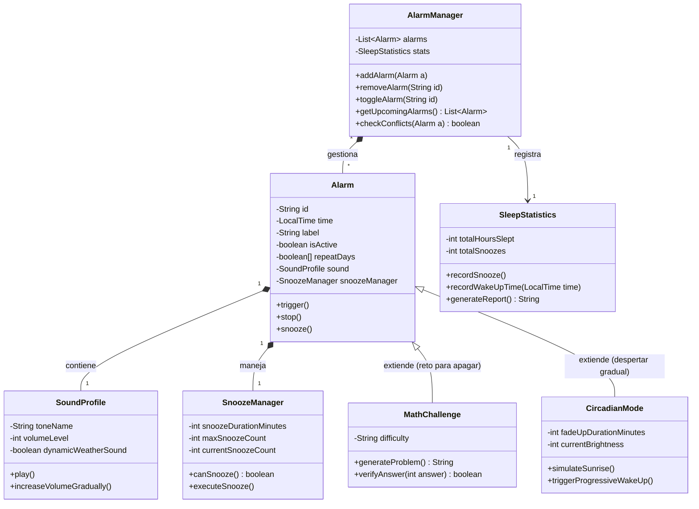

# ⏰ Sistema de Despertador Inteligente (Lógica en Java)

## 1. Descripción del proyecto
Implementación de la lógica interna (Core de Negocio) de una aplicación de despertador inteligente, inspirada en los sistemas de los smartphones modernos. El proyecto se centra en el diseño de software orientado a objetos puro, sin interfaz gráfica, gestionando desde alarmas recurrentes hasta funcionalidades avanzadas como el modo circadiano o la resolución de retos matemáticos.

## 2. Objetivos
*   **Técnicos:** Analizar requisitos funcionales y abstraer las funcionalidades en un modelo de clases robusto.
*   **Arquitectura:** Implementar la lógica de negocio totalmente desacoplada de la interfaz visual.
*   **Metodología:** Aplicar buenas prácticas de programación (SOLID, encapsulación), control de versiones profesional con Git/GitHub y documentación técnica.
*   **Productividad:** Utilizar herramientas de IA generativa de forma responsable y validada para asistir el desarrollo.

## 3. Tecnologías utilizadas
*   **Lenguaje:** Java
*   **Control de Versiones:** Git y GitHub (Flujo de trabajo mediante ramas y Pull Requests)
*   **Diseño UML:** PlantUML / Mermaid
*   **Documentación:** Markdown

## 4. Instalación y ejecución
Este proyecto está desarrollado puramente en Java sin dependencias externas, por lo que su ejecución se realiza directamente a través de la línea de comandos (terminal).

1. Clonar el repositorio en tu máquina local:
   `git clone [url-de-tu-repositorio-aqui]`
2. Abrir la terminal y navegar hasta el directorio raíz del proyecto:
   `cd despertador-inteligente-java`
3. Compilar todos los archivos fuente ubicados en la carpeta `src`:
   `javac src/*.java`
4. Ejecutar la clase principal para iniciar la simulación en consola:
   `java -cp src Main`

## 5. Estructura del proyecto
*   `/src`: Código fuente en Java.
*   `/docs`: Especificaciones de casos de uso y diagramas detallados.
*   `/tests`: Pruebas de funcionamiento (si procede).
*   `README.md`: Documentación principal.

---

## 6. Diseño orientado a objetos
*(Aquí explicaremos las decisiones arquitectónicas: por qué existen las clases, cuáles son sus responsabilidades, relaciones y cómo se maneja la visibilidad de los atributos).*

## 7. Diagrama de clases UML

## 8. Casos de Uso
flowchart LR
    Actor((Usuario))

    %% Casos de Uso Principales
    Crear[Crear Alarma]
    Gestionar[Activar/Desactivar/Eliminar Alarma]
    Configurar[Configurar Sonido y Repetición]
    Posponer[Posponer Alarma snooze]
    Detener[Detener Alarma]
    Consultar[Consultar Próximas Alarmas]
    Stats[Consultar Estadísticas de Sueño]

    %% Funcionalidades Avanzadas
    Reto[Resolver Reto Matemático]
    Circadiano[Configurar Modo Circadiano]

    %% Relaciones del Actor
    Actor --> Crear
    Actor --> Gestionar
    Actor --> Posponer
    Actor --> Detener
    Actor --> Consultar
    Actor --> Stats

    %% Relaciones Include y Extend
    Crear -. "<< include >>" .-> Configurar
    Detener -. "<< extend >>" .-> Reto
    Crear -. "<< extend >>" .-> Circadiano
    
## 9. Reflexión técnica
### Especificación Detallada de Casos de Uso

| Caso de Uso | CU-01: Crear Alarma |
| :--- | :--- |
| **Objetivo** | Configurar una nueva alarma en el sistema especificando hora, repetición y sonido. |
| **Actor principal** | Usuario |
| **Precondiciones** | El sistema (`AlarmManager`) está inicializado. |
| **Flujo principal** | 1. El usuario solicita crear una nueva alarma. 2. Introduce la hora y los minutos. 3. Selecciona los días de repetición. 4. Elige un perfil de sonido y volumen. 5. El sistema guarda la alarma y la marca como activa. |
| **Flujos alternativos** | 3a. El usuario no selecciona días de repetición: La alarma se configura para sonar una única vez (próximas 24h). 5a. Conflicto de horario: El sistema detecta otra alarma a la misma hora y lanza una advertencia. |
| **Postcondiciones** | La alarma queda registrada en la lista de alarmas y programada para sonar. |
| **Reglas de negocio** | No se permite crear dos alarmas con la misma configuración exacta (hora y días de repetición). |

 

| Caso de Uso | CU-02: Resolver Reto Matemático (Funcionalidad Avanzada) |
| :--- | :--- |
| **Objetivo** | Obligar al usuario a resolver un problema matemático para poder detener la alarma, asegurando que está despierto. |
| **Actor principal** | Usuario |
| **Precondiciones** | Una alarma con la funcionalidad de "Reto Matemático" activada está sonando. |
| **Flujo principal** | 1. El usuario intenta detener la alarma. 2. El sistema genera y muestra una operación matemática aleatoria. 3. El usuario introduce el resultado correcto. 4. La alarma se detiene completamente. |
| **Flujos alternativos** | 3a. El usuario introduce un resultado incorrecto: El sistema indica error, la alarma sigue sonando y genera un nuevo reto matemático. |
| **Postcondiciones** | La alarma pasa a estado inactivo y se registra el evento en las estadísticas de sueño. |
| **Reglas de negocio** | El volumen del sonido no se puede reducir ni silenciar mientras el reto matemático no haya sido resuelto. |
### Decisiones de Arquitectura y Patrones Aplicados

El diseño de este sistema se ha construido siguiendo estrictamente los principios de la Programación Orientada a Objetos (POO), buscando un código limpio, mantenible y escalable, cualidades fundamentales para superar pruebas técnicas en el sector profesional y grandes consultoras tecnológicas.

* **Principio de Responsabilidad Única (SRP):** Se ha evitado crear clases monolíticas. La clase `AlarmManager` actúa exclusivamente como controladora de la colección de alarmas, mientras que `Alarm` gestiona su propio estado interno. Separar lógicas distintas en métodos y clases independientes previene errores de flujo y comportamientos inesperados en el sistema.
* **Encapsulación estricta:** Todos los atributos de las clases son privados (`private`). El acceso y modificación del estado se realiza a través de métodos controlados (ej. `toggleActive()`), asegurando que ninguna clase externa pueda corromper los datos de una alarma.
* **Composición frente a Herencia:** En lugar de sobrecargar la clase `Alarm` con toda la lógica de posposición y sonido, se ha utilizado la composición (`*--` en UML). Las clases `SnoozeManager` y `SoundProfile` actúan como componentes independientes. Si en el futuro se desea cambiar el comportamiento del "snooze", el núcleo de la alarma permanecerá intacto.
* **Herencia y Polimorfismo:** Para las funcionalidades avanzadas (`MathChallenge` y `CircadianMode`), se ha aplicado herencia (`extends Alarm`). Esto permite extender el comportamiento base (como bloquear el apagado hasta resolver un reto matemático) sin llenar la clase principal de sentencias `if/else`, facilitando que `AlarmManager` pueda interactuar con cualquier tipo de alarma de forma transparente.

## 10. Reflexión sobre IA
Durante el desarrollo de este proyecto, se ha utilizado un asistente de Inteligencia Artificial como herramienta de apoyo educativo y acelerador de productividad, siempre bajo un enfoque de validación crítica y manual. 

* **Depuración de sintaxis UML:** La IA se utilizó para identificar y corregir errores léxicos (`Parse error` y `Lexical error`) en el marcado de los diagramas de Mermaid dentro de los bloques Markdown, asegurando su correcta renderización en GitHub.
* **Resolución de errores de compilación:** Actuó como guía para interpretar trazas de error en la consola (como `cannot find symbol` o `illegal start of type`). La IA ayudó a entender que el origen de estos fallos radicaba en problemas de alcance (fuera de las llaves del constructor) o en archivos no guardados/encontrados por el compilador de Java.
* **Estructuración base:** Se empleó para generar los esqueletos iniciales de las clases Java aplicando las directrices del diagrama UML previamente diseñado. 
* **Validación:** Ningún código generado se implementó a ciegas. Todas las funcionalidades y relaciones de clases se probaron de manera iterativa compilando manualmente a través de la terminal (`javac` y `java`) para comprobar que el flujo de datos cumplía con las reglas de negocio establecidas en los Casos de Uso.